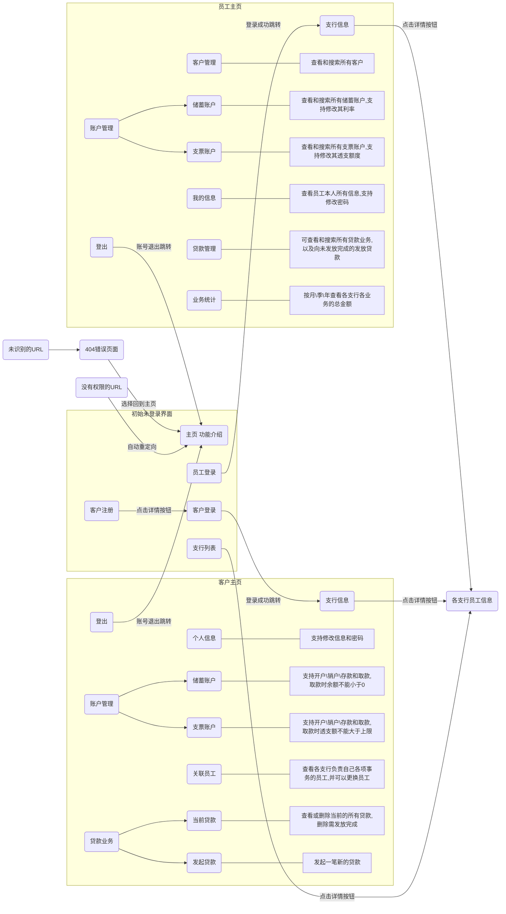

# 数据库实验 银行业务管理系统
PB19030925 李其正

## 概述

构建一个B/S结构的银行业务管理系统，实现系统的前端页面、后台服务器和数据库的设计构建。

在Vlab虚拟机上运行，通过Ngrok内网穿透已成功映射到公网：http://bankappbyming.5gzvip.91tunnel.com/

## 实验环境

* Win10系统，Pycharm Flask pipenv开发环境

* 使用Git托管代码，Github仓库地址：[Jensen246/DatabaseApplicationForUSTC2022 (github.com)](https://github.com/Jensen246/DatabaseApplicationForUSTC2022)

* 使用`MySQLdb`连接数据库（ps：后来在尝试部署到Linux虚拟机的过程中发现`MySQLdb`的兼容性实在太差，安装时因为包依赖等问题接连报错，所以部署过程中改用了`pymysql`）

* 技术栈：`MySQL`+`Flask`+`Jinja2`+`html`+`css`+~~`Javascript`~~（看了不少但没学会😭就没用上，很多想做的效果都没做出来）等，Pycharm相关设置如下：

  * 设置`Settings->Langurages & Frameworks->Flask`勾选`Flask Integration`

  * `Run->Edit Configurations->Flask`打开`FLASK_DEBUG`，从而在程序运行时进入Debug模式

  * 修改项目文件夹下的`idea/BankApplication.iml`可以实现`html`文件中的`jinja2`语法高亮：

    在component标签的同级，添加如下代码：

    ```ini
    <component name="TemplatesService">
    <option name="TEMPLATE_CONFIGURATION" value="Jinja2" />
    <option name="TEMPLATE_FOLDERS">
    <list>
    <option value="$MODULE_DIR$/templates" />
    </list>
    </option>
    </component>
    ```

## 项目启动方法

* 初始化数据库：

  不要求实现支行、部门和员工信息这三类数据的维护，但在程序开始运行之前需要插入这些数据，用命令行连接MySQL运行`batch_init.sql`即可，登录时将默认编码设置为`utf8`以免出现乱码：

  ```mysql
  mysql -u root -p --default-character-set=utf8
  password:******
  > source batch_init.sql
  ```

  该程序调用了多个sql文件，其中：

  * `init_database.sql`用于建库
  * `init_bank.sql`用于插入支行和部门
  * `init_employee.sql`用于初始化员工（包括初始化员工的登录用户名密码）
  * `init_customer.sql`用于插入一部分客户和他们的储蓄与支票账户记录
  * `init_loan.sql`用来插入一部分客户的贷款记录以及贷款的部分发放记录

  数据库初始化的数据在参考[学长代码](https://github.com/isaacveg/USTC_2021_DatabaseLab/tree/main/lab3)的基础上针对自己的数据库结构做了一点修改，其他部分均为原创
  
* 若需要将代码部署到其他环境下运行，只需`git clone`，在项目路径下建立一个新的`pipenv`，通过`pipenv install Pipfile`即可安装依赖

## 需求描述

### 数据需求
银行有多个支行。各个支行位于某个城市，每个支行有唯一的名字。银行要监控每个支行的资产。银行的客户通过其身份证号来标识。银行存储每个客户的姓名、联系电话以及家庭住址。为了安全起见，银行还要求客户提供一位联系人的信息，包括联系人姓名、手机号、Email 以及与客户的关系。客户可以有帐户，并且可以贷款。客户可能和某个银行员工发生联系，该员工是此客户的贷款负责人或银行帐户负责人。银行员工也通过身份证号来标识。员工分为部门经理和普通员工，每个部门经理都负责领导其所在部门的员工，并且每个员工只允许在一个部门内工作。每个支行的管理机构存储每个员工的姓名、电话号码、家庭地址及部门经理的身份证号。银行还需知道每个员工开始工作的日期，由此日期可以推知员工的雇佣期。银行提供两类帐户——储蓄帐户和支票帐户。帐户可以由多个客户所共有，一个客户也可开设多个账户，但在一个支行内最多只能开设一个储蓄账户和一个支票账户。每个帐户被赋以唯一的帐户号。银行记录每个帐户的余额、开户日期、开户的支行名以及每个帐户所有者访问该帐户的最近日期。另外，每个储蓄帐户有利率和货币类型，且每个支票帐户有透支额。每笔贷款由某个分支机构发放，能被一个或多个客户所共有。每笔贷款用唯一的贷款号标识。银行需要知道每笔贷款所贷金额以及逐次支付的情况（银行将贷款分几次付给客户）。虽然贷款号不能唯一标识银行所有为贷款所付的款项，但可以唯一标识为某贷款所付的款项。对每次的付款需要记录日期和金额。

###  主要功能需求  

* 客户管理：提供客户所有信息的增、删、改、查功能；如果客户存在着关联账户或者贷款记录，则不允许删除；
* 账户管理：提供账户开户、销户、修改、查询功能，包括储蓄账户和支票账户；账户号不允许修改；
* 贷款管理：提供贷款信息的增、删、查功能，提供贷款发放功能；贷款信息一旦添加成功后不允许修改；要求能查询每笔贷款的当前状态（未开始发放、发放中、已全部发放）；处于发放中状态的贷款记录不允许删除；
* 业务统计：按业务分类（储蓄、贷款）和时间（月、季、年）统计各个支行的业务总金额和用户数，统计的结果以表格形式展示  。  

## 具体实现时的功能设计

* 主页为登录/注册页面，可以注册新**客户**用户（**不含员工**用户，员工用户信息在初始化sql文件中插入数据库，且只能修改密码，不可修改其他属性），登录用户分为两类：客户和员工，他们的权限区分如下：
  * 客户用户：
    * 客户管理：增、删、改、查自己的信息（如果客户存在关联账户或贷款记录则不允许删除）
    * 账户管理：账户开户、销户、修改，包括储蓄账户和支票账户，账户号不可以修改；新增账户时需要从对应支行的对应部门选择一个员工做自己的账户负责人
    * 贷款管理：贷款信息的增、删、查功能
      * “增”指的是发起贷款，客户发起贷款后贷款状态为“未发放”，若用户在一家支行新增贷款时还没有这家支行对应的负责员工，需要选定一名负责员工；
      * “删”指的是删除贷款记录，删除贷款需要其状态为”发放完成“；
      * “查”指的是显示该用户每笔贷款的信息（状态分为：未开始发放、发放中、已全部发放）；
      * 贷款状态分为：未开始发放、发放中、已全部发放，客户发起贷款后贷款状态为“未发放”，由员工发放部分贷款后贷款状态为“发放中”，金额全部发放完后状态改为“已全部发放”；
    * 业务统计：用户不可以使用该功能
    * 新增功能：关系员工管理：可以查看和更改更改自己在各家支行各类业务的负责员工
  * 员工用户：
    * 客户管理：由客户自己操作，员工可以查看所有客户的个人信息，以及可以根据姓名、地址或联系人姓名中包含的字段模糊搜索客户
    * 账户管理：开户、销户、存款、取款功能由客户自己操作，员工有：
      * 查看权限：可以从客户管理界面查看每个客户的账户，也可以根据姓名或账户号搜索客户
      * 以及部分客户所没有的修改权限：修改储蓄账户的利率（限定范围为0~1），以及修改支票账户的透支额
    * 贷款管理：申请贷款、删除贷款由用户自己实现，员工负责进行发放贷款，也可以根据姓名或贷款号搜索客户
    * 业务统计：按业务分类（储蓄、支票、贷款）和时间（月、季、年）统计各个支行的业务总金额和用户数， 统计的结果以表格形式展示  
* 一些问题：
  * 没有实现多个客户共用一个账户的功能（只有初始插入数据库的数据可以做到）
  * 客户端实现的绑定与更换负责员工功能仅仅是为了展现`Employee_Customer`表，员工端没有实现查看或修改负责客户的功能，也就是说这个功能其实是没有意义的
  * 从实际应用角度来说，员工应该只可以查看和更改自己对应支行的客户、账户数据，但为了测试和初始化的方便，员工可以查看和更改所有客户的个人信息
  * 没有实现“最近查看时间”的查看和维护，个人认为这项属性意义不大
  * 业务统计对于储蓄账户和支票账户来说没有考虑到开户日期以后储蓄和取款的情况，如果要考虑这些因素可能需要维护额外的表


## 系统内部设计

### 后端-数据库设计

* 根据实验二的结果设计，根据总体功能设计新增/修改如下属性：
  * 对于员工和客户，为登录功能新增"用户名"和"密码"，且不允许登录系统出现重复用户名，url的构成也大多数使用了用户名，可以理解为实际使用时用作主键的是“用户名”
  * 储蓄账户中的"货币类型"用数字0，1，2，3分别表示人民币、美元、欧元和日元
  * 对于贷款表，新增"贷款发放状态"，用数字0，1，2表示三个状态
  * 对于员工表，新增"Is_Manager"属性，数字1，0分别表示是/不是经理
  * 对于部门表，将主键由"部门ID"改为“（支行，部门ID）”

#### 支行表

存储所有支行账户信息。  

| 属性          | 说明                |
| ------------- | ------------------- |
| Bank_Name     | 主键，支行的名称    |
| Bank_City     | 支行所在城市        |
| Bank_Property | 支行资产，默认值为0 |

```sql
/*==============================================================*/
/* Table: SubBank                                               */
/*==============================================================*/
create table SubBank
(
   Bank_Name            char(32) not null  comment '支行名称',	
   Bank_City            char(32)  comment '支行所在城市',
   Bank_Property        float  DEFAULT 0.0 comment '支行资产',
   primary key (Bank_Name)
);
```

#### 员工表

存储支行员工的信息  

| 属性                 | 说明                               |
| -------------------- | ---------------------------------- |
| Employee_ID          | 主键，员工身份证号码               |
| Department_ID        | 员工所在部门ID                     |
| Employee_Name        | 员工姓名                           |
| Employee_PhoneNumber | 员工电话                           |
| Employee_Address     | 员工家庭住址                       |
| Employee_Enter_Date  | 员工入职日期                       |
| Employee_Username    | 员工账户用户名                     |
| Employee_Password    | 员工账户密码                       |
| Is_Manager           | 经理标识，0表示普通员工，1表示经理 |

```sql
/*==============================================================*/
/* Table: Employee                                              */
/*==============================================================*/
create table Employee
(
   Employee_ID          char(16) not null  comment '员工身份证号码',
   Department_ID        char(32) not null  comment '员工所在部门ID',
   Employee_Name        char(32)  comment '员工姓名',
   Employee_PhoneNumber decimal(12)  comment '员工电话',
   Employee_Address     char(64)  comment '员工家庭住址',
   Employee_Enter_Date  date  comment '员工入职日期',
   Employee_Username	char(16) not null comment '员工账户用户名',
   Employee_Password	char(16) not null comment '员工账户密码',
   Is_Manager			tinyint not null comment '经理标识',
   primary key (Employee_ID)
);
```

#### 客户表

储存所有客户信息

| 属性                      | 说明                 |
| ------------------------- | -------------------- |
| User_ID                   | 主键，客户身份证号码 |
| User_Name                 | 客户姓名             |
| User_PhoneNumber          | 客户电话             |
| User_Address              | 客户家庭地址         |
| User_Contacts_Name        | 联系人姓名           |
| User_Contacts_PhoneNumber | 联系人电话           |
| User_Contacts_Email       | 联系人电子邮件       |
| User_Contacts_Relation    | 客户与联系人关系     |
| User_Username             | 客户账户用户名       |
| User_Password             | 客户账户密码         |

```sql
/*==============================================================*/
/* Table: Customer                                              */
/*==============================================================*/
create table Customer
(
   User_ID              char(16) not null  comment '客户身份证号码',
   User_Name            char(32)  comment '客户姓名',
   User_PhoneNumber     char(16)  comment '客户电话',
   User_Address         char(64)  comment '客户家庭地址',
   User_Contacts_Name   char(32)  comment '联系人姓名',
   User_Contacts_PhoneNumber char(16)  comment '联系人电话',
   User_Contacts_Email  char(32)  comment '联系人电子邮件',
   User_Contacts_Relation char(32)  comment '客户与联系人关系',
   User_Username	char(16) not null comment '员工账户用户名',
   User_Password	char(16) not null comment '员工账户密码',
   primary key (User_ID)
);
```

#### 部门表

存储部门信息，营销部负责储蓄和支票账户，客服部负责贷款

| 属性                  | 说明         |
| --------------------- | ------------ |
| Department_ID         | 部门ID，主键 |
| Bank_Name             | 支行名称     |
| Department_Name       | 部门名称     |
| Department_Type       | 支行类型     |
| Department_Manager_ID | 支行经理ID   |

```sql
/*==============================================================*/
/* Table: Department                                            */
/*==============================================================*/
create table Department
(
   Department_ID        char(32) not null  comment '部门ID',
   Bank_Name            char(32) not null  comment '支行名称',
   Department_Name      char(32)  comment '部门名称',
   Department_Type      char(32)  comment '支行类型',
   Department_Manager_ID char(16) not null  comment '支行经理ID',
   primary key (Department_ID)
);
```

#### ~~账户表~~

即支票账户与储蓄账户的父类，但在实际业务中不需要，故删除

| 属性            | 说明     |
| --------------- | -------- |
| Account_ID      | 账户号   |
| Account_balance | 账户余额 |
| Reg_Date        | 开户日期 |
| Reg_Bank        | 开户支行 |

```sql
/*==============================================================*/
/* Table: Account                                               */
/*==============================================================*/
create table Account
(
   Account_ID           char(32) not null  comment '账户号',
   Account_balance      float  comment '账户余额',
   Reg_Date             date  comment '开户日期',
   Reg_Bank             char(32)  comment '开户支行',
   primary key (Account_ID)
);
```

#### 支票账户表

存储支票账户信息

* 账户号以`ck + 数字`表示，建立新支票账户时数字取数据库中的最大值+1
* 透支额度表示该账户能够超出余额取款的最大额度，也就是说支票账户的余额可以为一个绝对值以透支余额为上限的负值

| 属性            | 说明             |
| --------------- | ---------------- |
| Account_ID      | 主键，支票账户号 |
| Account_balance | 账户余额         |
| Reg_Date        | 开户日期         |
| Reg_Bank        | 开户支行         |
| Overdraft       | 透支额度         |

```sql
/*==============================================================*/
/* Table: CheckAccount                                          */
/*==============================================================*/
create table CheckAccount
(
   Account_ID           char(32) not null  comment '支票账户号',
   Account_balance      float  comment '账户余额',
   Reg_Date             date  comment '开户日期',
   Reg_Bank             char(32)  comment '开户支行',
   Overdraft            float  comment '透支额度',
   primary key (Account_ID)
);
```

#### 储蓄账户表

储存储蓄账户信息 ，账户号以`dp + 数字`表示，建立新储蓄账户时数字取数据库中的最大值+1

| 属性            | 说明                                     |
| --------------- | ---------------------------------------- |
| Account_ID      | 储蓄账户号                               |
| Account_balance | 账户余额                                 |
| Reg_Date        | 开户日期                                 |
| Reg_Bank        | 开户行                                   |
| Interest_Rate   | 利率                                     |
| Currency_type   | 货币类型： 0:人民币 1:美元 2:欧元 3:日元 |

```sql
/*==============================================================*/
/* Table: DepositAccount                                        */
/*==============================================================*/
create table DepositAccount
(
   Account_ID           char(32) not null  comment '储蓄账户号',
   Account_balance      float  comment '账户余额',
   Reg_Date             date  comment '开户日期',
   Reg_Bank             char(32)  comment '开户行',
   Interest_Rate        float  comment '利率',
   Currency_type        int(1)  comment '货币类型',
   primary key (Account_ID)
);
```

#### 贷款表 

存储所有的贷款信息，贷款号以`ln + 数字`的形式表示，建立新贷款时数字取数据库中的最大值+1

| 属性        | 说明                                                         |
| ----------- | ------------------------------------------------------------ |
| Loan_ID     | 主键，贷款号                                                 |
| Bank_Name   | 发放支行支行名                                               |
| Loan_Money  | 贷款额度                                                     |
| Loan_Status | 发放状态： 0:"未开始发放" 1:"发放中" 2:"已全部发放"，默认为0 |

```sql
/*==============================================================*/
/* Table: Loan                                                  */
/*==============================================================*/
create table Loan
(
   Loan_ID              char(16) not null  comment '贷款号',
   Bank_Name            char(32) not null  comment '发放支行名',
   Loan_Money           float  comment '贷款额度',
   Loan_Status			int(1)	DEFAULT 0 comment '发放状态',
   primary key (Loan_ID)
);
```

#### 支付情况表

存储贷款的支付情况，考虑到一笔贷款可能分多次支付，增加支付日期`Pay_Date`与贷款号`Loan_ID`共同作为主键

| 属性      | 说明                   |
| --------- | ---------------------- |
| Loan_ID   | 主键，支付对应的贷款号 |
| Pay_Date  | 主键，支付日期         |
| Pay_Money | 支付金额               |

```sql
/*==============================================================*/
/* Table: Payment                                               */
/*==============================================================*/
create table Payment
(
   Loan_ID              char(16) not null  comment '支付对应的贷款号',
   Pay_Date             date  comment '支付日期',
   Pay_Money            float  comment '支付金额',
   primary key (Loan_ID,Pay_Date)
);
```

#### 客户-储蓄账户唯一表

用客户-储蓄账户的组合实体和账户做一（账户）对多（组合）的关系映射，以实现”一个用户在一个支行内最多只能开设一个储蓄账户  “

| 属性           | 说明                 |
| -------------- | -------------------- |
| User_ID        | 主键，户主身份证号码 |
| Bank_Name      | 主键，开户支行支行名 |
| Account_ID     | 对应的储蓄账户账户号 |
| Last_View_Date | 最近访问日期         |

```sql
/*==============================================================*/
/* Table: Customer_DepositAccount                               */
/*==============================================================*/
create table Customer_DepositAccount
(
   User_ID              char(16) not null  comment '户主身份证号码',
   Bank_Name            char(32) not null  comment '开户支行支行名',
   Account_ID           char(32) not null  comment '对应的储蓄账户账户号',
   Last_View_Date       date  comment '最近访问日期',
   primary key (User_ID, Bank_Name)
);
```

#### 客户-支票账户唯一表 

与客户-储蓄账户唯一表同理

| 属性           | 说明                 |
| -------------- | -------------------- |
| User_ID        | 主键，户主身份证号码 |
| Bank_Name      | 主键，开户支行支行名 |
| Account_ID     | 对应的支票账户账户号 |
| Last_View_Date | 最近访问日期         |

```sql
/*==============================================================*/
/* Table: Customer_CheckAccount                                 */
/*==============================================================*/
create table Customer_CheckAccount
(
   User_ID              char(16) not null  comment '户主身份证号码',
   Bank_Name            char(32) not null  comment '开户支行支行名',
   Account_ID           char(32) not null  comment '对应的支票账户账户号',
   Last_View_Date       date  comment '最近访问日期',
   primary key (User_ID, Bank_Name)
);
```

#### 客户-贷款表

记录客户和贷款的对应关系

| 属性    | 说明                 |
| ------- | -------------------- |
| Loan_ID | 主键，贷款号         |
| User_ID | 主键，用户身份证号码 |

```sql
/*==============================================================*/
/* Table: Customer_Loan                                         */
/*==============================================================*/
create table Customer_Loan
(
   Loan_ID              char(16) not null  comment '贷款号',
   User_ID              char(16) not null  comment '用户身份证号码',
   primary key (Loan_ID, User_ID)
);
```

#### 员工-客户表

* 服务类型用"ck", "dp", "ln"分别代表支票账户、储蓄账户和贷款业务
* 考虑到设计银行功能时客服部同时负责支票账户和储蓄账户，增加服务类型主键

| 属性         | 说明                 |
| ------------ | -------------------- |
| Employee_ID  | 主键，员工身份证号码 |
| User_ID      | 主键，用户身份证号码 |
| Service_Type | 主键，服务类型       |

```sql
/*==============================================================*/
/* Table: Employee_Customer                                     */
/*==============================================================*/
create table Employee_Customer
(
   Employee_ID          char(16) not null  comment '员工身份证号码',
   User_ID              char(16) not null  comment '用户身份证号码',
   Service_Type         char(32)  comment '服务类型',
   primary key (Employee_ID, User_ID, Service_Type)
);
```

#### 外键约束

使用lab2的pdm文件生成sql代码，并根据数据库的改动作少量修改即可

```sql
alter table CheckAccount add constraint FK_CHECKACC_ACCOUNT_C_ACCOUNT foreign key (Account_ID)
      references Account (Account_ID)   ;

alter table Customer_CheckAccount add constraint FK_CUSTOMER_CHECKACCO_CHECKACC foreign key (Account_ID)
      references CheckAccount (Account_ID) on delete restrict on update restrict;

alter table Customer_CheckAccount add constraint FK_CUSTOMER_CUSTOMER__CUSTOMER foreign key (User_ID)
      references Customer (User_ID) on delete restrict on update restrict;

alter table Customer_CheckAccount add constraint FK_CUSTOMER_SUBBANK_C_SUBBANK foreign key (Bank_Name)
      references SubBank (Bank_Name) on delete restrict on update restrict;

alter table Customer_DepositAccount add constraint FK_CUSTOMER_CUSTOMER__CUSTOMER1 foreign key (User_ID)
      references Customer (User_ID) on delete restrict on update restrict;

alter table Customer_DepositAccount add constraint FK_CUSTOMER_DEPOSITAC_DEPOSITA foreign key (Account_ID)
      references DepositAccount (Account_ID) on delete restrict on update restrict;

alter table Customer_DepositAccount add constraint FK_CUSTOMER_SUBBANK_D_SUBBANK foreign key (Bank_Name)
      references SubBank (Bank_Name) on delete restrict on update restrict;

alter table Customer_Loan add constraint FK_CUSTOMER_CUSTOMER__LOAN foreign key (Loan_ID)
      references Loan (Loan_ID) on delete restrict on update restrict;

alter table Customer_Loan add constraint FK_CUSTOMER_CUSTOMER__CUSTOMER2 foreign key (User_ID)
      references Customer (User_ID) on delete restrict on update restrict;

alter table Department add constraint FK_DEPARTME_SUBBANK_D_SUBBANK foreign key (Bank_Name)
      references SubBank (Bank_Name) on delete restrict on update restrict;

alter table DepositAccount add constraint FK_DEPOSITA_ACCOUNT_D_ACCOUNT foreign key (Account_ID)
      references Account (Account_ID) on delete restrict on update restrict;

alter table Employee add constraint FK_EMPLOYEE_EMPLOYEE__DEPARTME foreign key (Department_ID)
      references Department (Department_ID) on delete restrict on update restrict;

alter table Employee_Customer add constraint FK_EMPLOYEE_EMPLOYEE__EMPLOYEE foreign key (Employee_ID)
      references Employee (Employee_ID) on delete restrict on update restrict;

alter table Employee_Customer add constraint FK_EMPLOYEE_EMPLOYEE__CUSTOMER foreign key (User_ID)
      references Customer (User_ID) on delete restrict on update restrict;

alter table Loan add constraint FK_LOAN_LOAN_SUBB_SUBBANK foreign key (Bank_Name)
      references SubBank (Bank_Name) on delete restrict on update restrict;

alter table Payment add constraint FK_PAYMENT_PAY_LOAN_LOAN foreign key (Loan_ID)
      references Loan (Loan_ID) on delete restrict on update restrict;
```

### 后端-Flask设计

参考了[简介 - Flask 入门教程 (helloflask.com)](https://read.helloflask.com/)，但由于本人没有接触过前端技术，很多比如表单界面可以在当前url弹出的都使用了新的url做跳转（尝试过写Javascript脚本实现但失败了），无形中增加了很多工作量，代码逻辑其实很简单：先进入路由，需要检查权限的检查权限，需要执行SQL语句的就执行（其实使用的只有`select`, `update`, `delete`这集中语句），需要获取表单的就用POST方式`request`获取表单，代码实现都在`app.py`中，很易于理解

### 后端-其他设计

#### 登录和注册界面

* 输入合法性问题：

  * 单引号处理：对可能出现单引号的字符串采用字符串替换在单引号前加转义符，比如用户名和密码（其他同理）：

    ```python
    username = username.replace('\'', '\\\'')
    password = password.replace('\'', '\\\'')
    ```

  * 其他合法性问题（如<u>邮箱格式</u>，<u>输入字段的长度和类型</u>等）：注册和修改信息时，采用`WTform`内置的表单认证实现，认证类放在`forms_verify.py`中以供调用


* 安全存储密码

  
  * 把密码明文存储在数据库中是极其危险的， 假如攻击者窃取了你的数据库， 那么用户的账号和密码就会被直接泄露。更保险的方式是对每个密码进行计算生成独一无二的密码散列值， 这样即使攻击者拿到了散列值， 也几乎无法逆向获取到密码。  
  * `Flask`的依赖`Werkzeug`内置了用于生成和验证密码散列值的函数，`werkzeug.security.generate_password_hash()`用来为给定的密码生成密码散列值， 而`werkzeug.security.check_password_hash()`则用来检查给定的散列值和密码是否对应 。使用示例如下所示： 
  
  ```python
  >>> from werkzeug.security import generate_password_hash, check_password_hash
  >>> pw_hash = generate_password_hash('dog') # 为密码 dog 生成密码散列值
  >>> pw_hash # 查看密码散列值
  'pbkdf2:sha256:50000$mm9UPTRI$ee68ebc71434a4405a28d34ae3f170757fb424663dc0ca15198cb881edc0978f'
  >>> check_password_hash(pw_hash, 'dog') # 检查散列值是否对应密码 dog
  
  True
  >>> check_password_hash(pw_hash, 'cat') # 检查散列值是否对应密码 cat
  
  False
  ```
  
  * 在数据库中，存储用户信息的 User 模型类添加了`username`字段和`password_hash`字段， 分别用来存储登录所需的用户名和密码散列值， 同时添加两个方法来实现设置密码和验证密码的功能。<u>数据库中预先存放了用于测试的用户的简单用户名密码（均为中文姓名拼音或英文姓名字母）</u>，密码为原始非散列值；而<u>注册新用户和修改密码</u>产生的密码则会以散列值形式存储到数据库中。登录时，输入的密码与数据库中存储的字段相同（对于提前存入的测试用户）、或是`check_password_hash()`返回`True`均能成功登录，不同的是前者会产生一个修改密码的不安全提醒。
  * 值得一提的是，采用散列值函数验证密码同时也避免了MySQL注入问题，因为验证密码的流程是：先按用户名检索数据库中的密码（这个密码一般是散列值），再用`werkzeug.security.check_password_hash()`校验密码

#### 权限管理

如果获知了该管理系统url设置的规则，在不设计权限管理的情况下，只需要在地址栏改变url就可以访问任何想要访问的用户，本系统则利用`flask.session`完成了权限管理。

* Session的概念

  session 是基于cookie实现， 保存在服务端的键值对（形式为 {随机字符串：‘xxxxxx’}）, 同时在浏览器中的cookie中也对应一相同的随机字符串，用来再次请求的 时候验证；对于Flask，session存在浏览器中  默认key是session(加密的cookie)， 也可以像Django一样基于上述的方式实现保存在数据库中

* 具体实现逻辑：有两种方案

  * 方案一

    当客户或员工通过`login_customer.html`或`login_employee.html`页面成功登录时，记录`session['username']`为当前用户名，登出时则用`session.pop('username',None)`删除这一记录，当进入需要登录权限的url时，检验url中的用户名是否和session中相同，若不同则返回未登录的初始界面

    这种方案的缺点是一次只能登录一个用户

  * 方案二

    用`session[username]`存储当前处于登录状态的用户，每次登录成功时设置`session[username]=True`，登出或注销时时通过`session.pop(username)`删除用户名，当进入需要登录权限的url时，检验url中的用户名是否满足`session[username]=True`，若不满足则返回未登录的初始界面

    方案二解决了方案一的缺点，但不知道如果用户A和用户B同时在登录状态，用户A能不能直接进入用户B权限的url。猜想若实际进行部署，每台客户机的session是按照浏览器或IP地址分别维护的，是可以实现权限保护的。

  * 实验过程中一开始采用方案一，后改用方案二，可在Github上查看[历史commit记录](https://github.com/Jensen246/DatabaseApplicationForUSTC2022/commits/main)

### 前端

`html` + `css` + `jinja2`模板，因为没有接触过，做诸如导航栏下拉菜单、下拉选项表单这样的功能的时候都摸索了很久，下面给出一个简单的网页跳转图



## Git提交记录

时间顺序为从下到上

* 04efd5d (HEAD -> main, origin/main) 修改了使用说明和业务统计模块季度显示
* 3e086d1 增加了主页使用说明和错误处理界面
* 1192ed8 已完成全部功能！需要完善的部分有：增加主页使用说明，以及404错误页面报告
* 49acce8 完成了贷款业务，实现了贷款的查询和发放贷款，还剩最后一项任务 业务统计
* dfca8f4 完成了员工端的客户管理和储蓄账户管理，包括查询客户和账户、修改利率
* bc14a97 实现了客户查看和修改关联员工的功能，并修复了包括账户开户时关联错误的部门、建立贷款关联错误的部门、关联员工职位显示错误等bug，完成了客户端的所有功能，剩余实现员工端的功能
* 09b7224 完成了客户端的贷款业务，包括申请贷款、删除之前的贷款以及在客户申请一个新支行的贷款时为其绑定一个银行员工作为负责人，计划为客户新增一个能查看自己当前各个业务的负责人的板块，并为其实现解除负责关系的功能
* ce1495e 完成了储蓄账户的开户、销户、储蓄和取款功能，并修复了支票账户储蓄取款时一次更新所有账户和前端输入框显示错误的bug，上一次提交测试时由于测试用户只有一个支票账户而未能发现该bug
* f6f765c 为客户端支票账户的取款功能增加了检验透支额度功能，同时根据支票账户部分的代码实现了客户端储蓄账户，现在客户端已经可以看到储蓄账户的详情，但由于两种账户表结构不同，其他功能需要进一步修改代码，下一步完成支票账户的开户功能
* a3ea3fc 完成了客户端支票账户的所有功能，包括储蓄、取款、开户和销户
* 0f91c94 完成了用户端支票账户的显示以及支票账户开户功能，待完成的是销户、储蓄和存款
* b95315d 完成了用户端支票账户的显示以及支票账户开户功能，待完成的是销户、储蓄和存款
* c2febea 完成了导航栏下拉菜单
* d3360b6 增加了客户个人信息页的注销账户功能
* ad358ba 完成了客户和员工的个人信息页面、客户部分个人信息的修改以及客户员工密码的修改，期间试图将密码认证功能封装到LoginManage.py中，但由于某些原因，这种做法会导致修改密码后密码不能及时更新，调试发现问题正处在上述文件中，但没弄清楚为何会产生该bug，最终决定将该封装去掉，在app.py的每个路由中分别实现密码验证，bug成功消除
* ec64cde 完成了贷款初始化，为每家银行给定了初始资产，以及修改了数据部分初始化
* 6715f91 完成了登录权限管理，现在仅能通过登录而不能通过url访问客户/员工主页，并完善了注册功能，现在注册用户名如果和数据库中重复将会报错
* cbcdb36 完成了登录和注册、注册表单的验证以及数据库内部的密码保护，下一步实现用户和员工登录后的主页
* aa41724 完成了支行详情页，但其前端仍需优化
* f0a6934 完成了主页的创建，并成功连接了数据库，查询并在主页显示支行列表
* 17c6213 完成了数据库的初始化并插入了一部分初始数据
* d78bb99 添加了外键约束，完成了数据库的数据结构

## 参考

[1] [Flask干货：访问数据库——Python数据库框架MySQL-Python - 知乎 (zhihu.com)](https://zhuanlan.zhihu.com/p/183797110)

[2] [WTForm表单验证 - 天青色wy - 博客园](https://www.cnblogs.com/wangyi0419/p/12710263.html)

[3] [Flask Sessions会话 - Flask教程™](https://www.yiibai.com/flask/flask_sessions.html)

**[4] [简介 - Flask 入门教程](https://read.helloflask.com/)**

[5] [【Python】 MySQLdb的安装与使用 - K.Takanashi - 博客园](https://www.cnblogs.com/franknihao/p/7267182.html)

[6] [HTML 输入类型](https://www.w3school.com.cn/html/html_form_input_types.asp)

[7] [下拉内容菜单 | 菜鸟工具](https://c.runoob.com/codedemo/452/)

......
